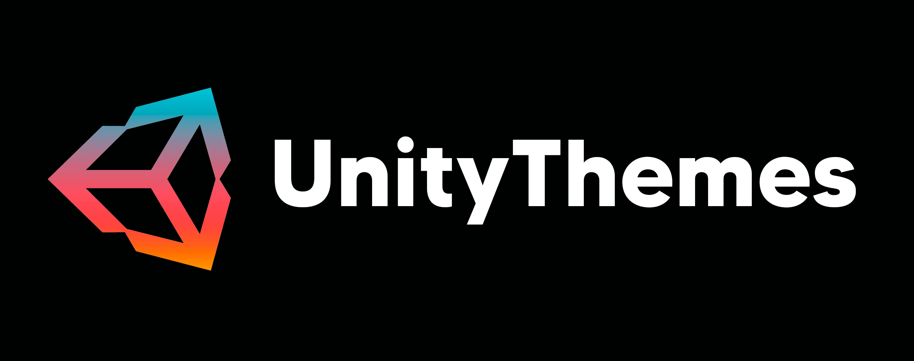
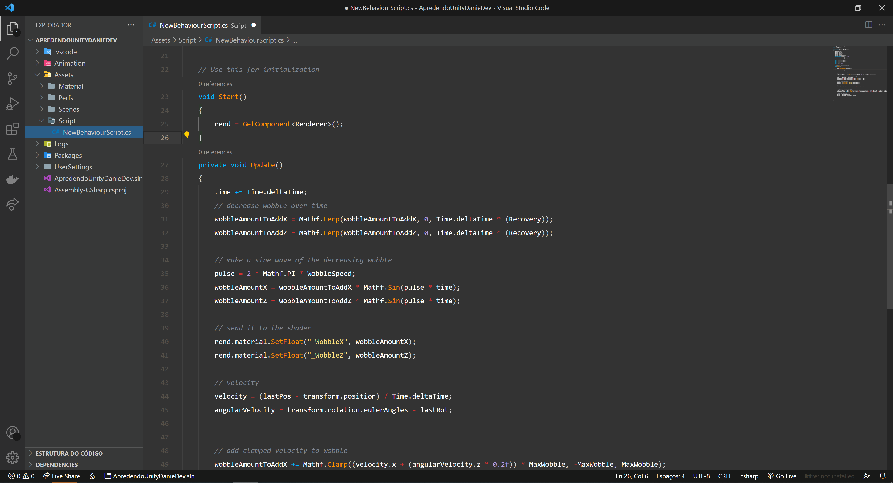
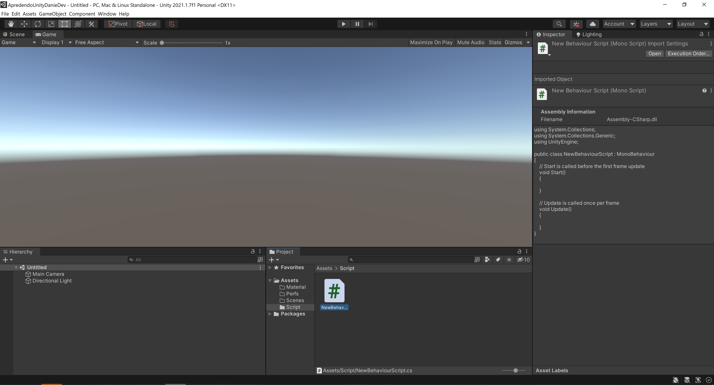

  
   
   
   
  
Download this theme with Uniyt engine colors for VS Code

  
Here's a preview: Theme VsCode

  
  
Here's a preview: engine unity

  
  
Theme created by <a href="https://www.linkedin.com/in/daniel-779b9b18b/">Daniel</a>

   
     
       
       <a href="https://www.youtube.com/channel/UCWFI5HN35DC7kw-D4GZ1d4w">
          <i>Youtube</i>
        </a> / 
        <a href="https://www.instagram.com/danielfilipe7387/">
          <i>Instagran</i>
        </a>
   
   

